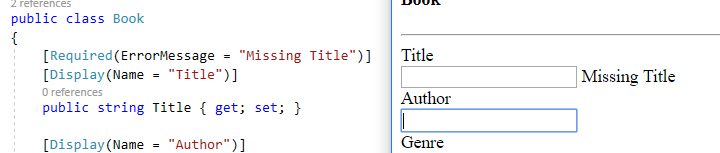
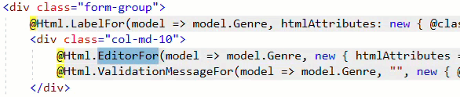

# WELCOME TO SESSION 2

---

## MODE OF OPERATION

- Topic Intro
- Show some code
- Type the code
- Run the code / verify results
- Questions
- Exercise

---

## WHAT WE WILL COVER:

- Forms Refresher
- Additional Form Inputs
- Enhancing the Model
- Basic Validation

---

## NOT COVERED:

- JavaScript/JQuery/Ajax
- CSS/Bootstrap
- Database/Entity Framework
- MVC Team Project Template

---

## GET READY FOR THE REFRESHER

10 Minutes

---

## HINTS

@ul
- ASP.NET Web Application - "BookInventory"
  - "Empty" project template
  - MVC box is checked
- Add a "Book" model
- Add a "Home" controller
- Add an "Index" view
  - Template - "Create"
  - Model class - "Book"
  - Use a layout page - unchecked
@ulend

---

## BOOK MODEL

<table>
    <tr>
        <th>Property</th>
        <th>Type</th>
    </tr>
    <tr>
        <td>Title</td>
        <td>string</td>
    </tr>
    <tr>
        <td>Author</td>
        <td>string</td>
    </tr>
    <tr>
        <td>Genre</td>
        <td>string</td>
    </tr>
    <tr>
        <td>IsPublicDomain</td>
        <td>bool</td>
    </tr>
    <tr>
        <td>PublisherEmail</td>
        <td>string</td>
    </tr>
    <tr>
        <td>PublishDate</td>
        <td>DateTime</td>
    </tr>
</table>

---

## LIVE DEMO

---

## LET'S ENHANCE THE MODEL

15-20 Minutes

---

@snap[west span-50]
## Can we customize the labels?
@snapend

@snap[east span-50]

@snapend

---

## ANNOTATE THE PROPERTY FOR CUSTOM LABELS

---

@snap[west span-50]
## *PRO TIP*: Hit Ctrl and "." then hit enter
@snapend

@snap[east span-50]

@snapend

---

@snap[west span-50]

@snapend

@snap[east span-50]

@snapend

---

@snap[north]
## YOUR TURN
@snapend

@snap[west span-50]
Add custom labels to all properties and add any appropriate datatypes
@snapend

@snap[east span-50]

@snapend

---

## LIVE DEMO

---

## QUESTIONS?

---

## SIMPLE VALIDATION

20-25 Minutes

---

## LET'S UPDATE THE CONTROLLER

---

## ENFORCE REQUIRED FIELDS

---

## YOUR TURN

Apply the required annotation to all appropriate properties

---

## LIVE DEMO

---

## QUESTIONS?

---

## ADDING A DROPDOWN

10 Minutes

---

## HTML HELPERS

---

## HELPING YOURSELF

F12 is your friend!

---

## Html.DropDownListFor

